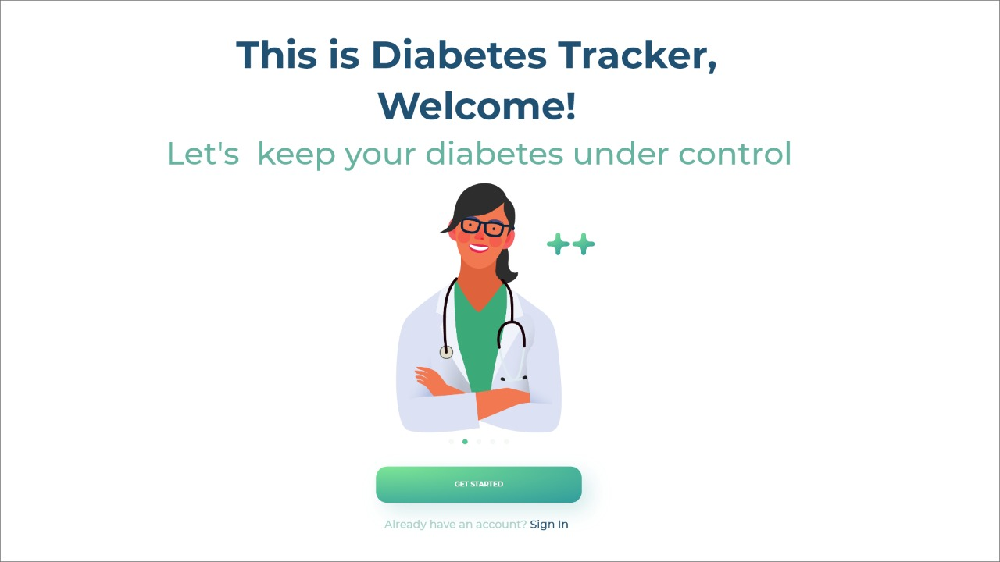
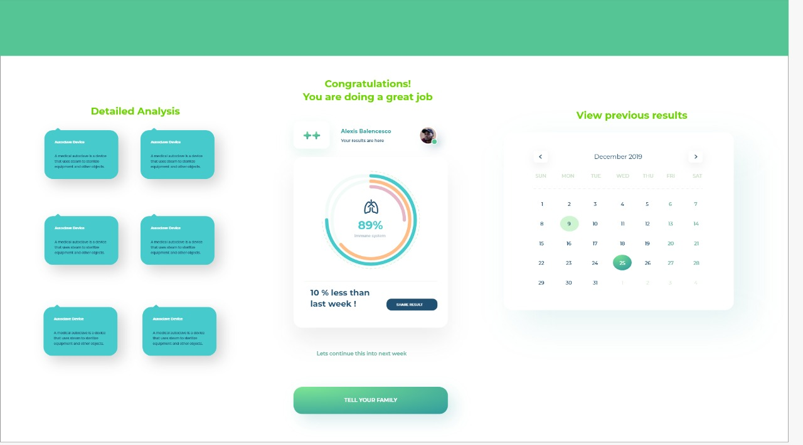
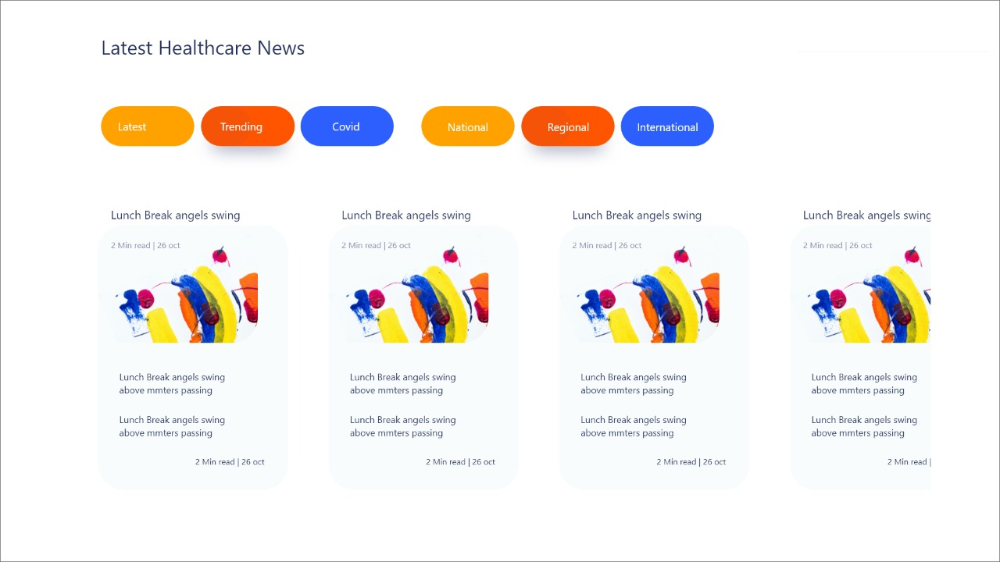
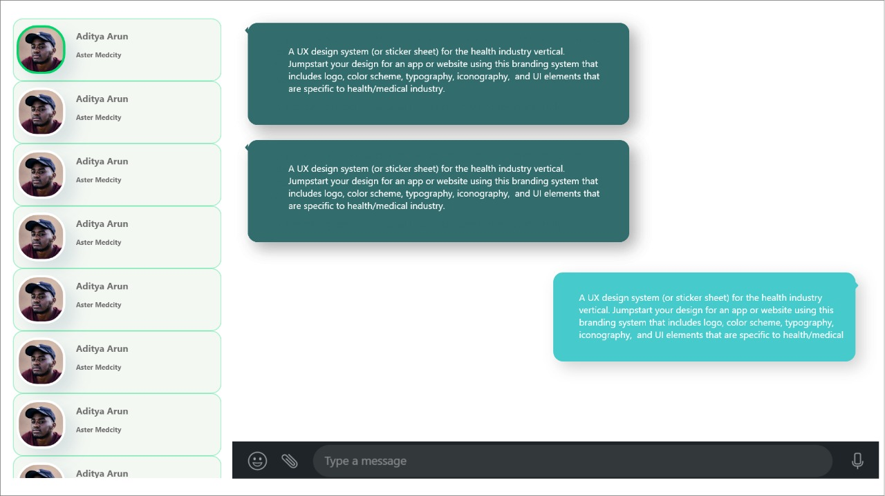
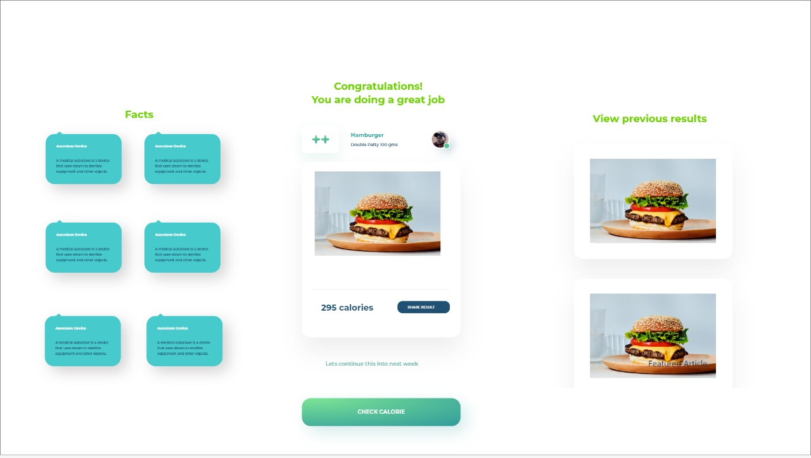

# Diabetes Tracking App

This is a simple application for diabetes tracking made using flask. The app has a few features that helps in the same. 
.This application helps you in figuring out which foods are best for keeping your blood sugar in a healthy range. The application has features that lets you scan or search for foods and see its calorie quality. The app makes it easy for you to track and discover more information about the foods you put in your body, including added sugar content, hidden ingredients, and more.
.There is an option to communicate with the doctor. All of the data and charts can be to send to your doctor, so you can work together to adjust your treatment and better manage your diabetes based on real, accurate information.
.The home page of the application features the latest news and updates in the health inudstry.

# Contents of project directory

- TheMavericks, zip file(The flask application)
- Screenshots of the design prototypes
- ppt presentation about the project

# How to host the project in your local host
- Download TheMavericks zip file (the flask application) in your local system.
- unzip the file named TheMavericks
- Install flask in your local system if you don't have it;
command to install flask: pip install flask
- open the project location in your terminal
- run the following commands;
  1. set FLASK_APP=project
  2. set FLASK_DEBUG=1
  3. flask run 
- The project will be running in your localhost at port 5000.

# Screenshots of prototype

# Group
## The Mavericks
- Thomas George(CS5B)
- Shweta Cheison (CS5B)
- Aiswarya Ajai(EC5A)
- Aditya Arun(CS5B)
